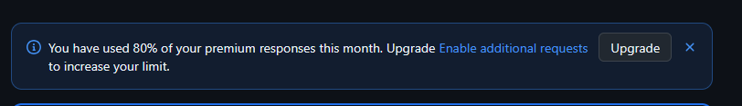

# WarningFix

Ferramenta de linha de comando para automatizar a correção de warnings em projetos .NET utilizando IA (GitHub Copilot ou OpenAI).

## Descrição

O WarningFix analisa arquivos de log de build do MSBuild/Visual Studio(Output), identifica warnings de compilação C# e gera prompts otimizados para que agentes de IA possam corrigir automaticamente os problemas no código-fonte.

## Funcionalidades

- **Parser de Warnings**: Analisa logs de build e extrai informações detalhadas sobre warnings (código, mensagem, arquivo, linha, coluna)
- **Estatísticas**: Agrupa e exibe estatísticas sobre os warnings encontrados
- **Geração de Prompts**: Cria prompts inteligentes com instruções específicas para cada tipo de warning
- **Integração com IA**: 
  - GitHub Copilot SDK (modo padrão)
  - OpenAI/GitHub Models API (modo alternativo)
- **Ferramentas de Edição**: Conjunto de ferramentas para que o agente de IA possa modificar arquivos

## Requisitos

- **.NET 10** ou superior
- **GitHub Copilot** (para modo Copilot SDK)
- **API Key do GitHub Models** (para modo OpenAI - opcional)

## Dependências

| Pacote | Versão | Descrição |
|--------|--------|-----------|
| GitHub.Copilot.SDK | 0.1.14 | SDK para integração com GitHub Copilot |
| Microsoft.Agents.AI | 1.0.0-preview | Framework de agentes IA da Microsoft |
| Microsoft.Agents.AI.OpenAI | 1.0.0-preview | Integração OpenAI para Microsoft Agents |
| Microsoft.Extensions.Configuration | 10.0.2 | Gerenciamento de configuração |
| Microsoft.Extensions.Logging.Console | 10.0.2 | Logging no console |
| OpenAI | 2.8.0 | Cliente OpenAI para .NET |
| StreamJsonRpc | 2.23.32-alpha | Comunicação JSON-RPC |
| JetBrains.Annotations | 2025.2.4 | Anotações para análise de código |

## Instalação

```bash
git clone https://github.com/mguilher/WarningFix.git
cd WarningFix
dotnet build
```

## Uso

### Via linha de comando

```bash
# Passando o arquivo de log como argumento
dotnet run --project WarningFix -- "caminho/para/build.log"

# Modo interativo (sem argumentos)
dotnet run --project WarningFix
# Digite o caminho do arquivo quando solicitado
```

### Formato do arquivo de log

O arquivo de log deve conter warnings no formato padrão do MSBuild:

```
16>D:\GitHub\Backend\MyApi\Service.cs(110,36,110,60): warning CS8601: Possible null reference assignment.
```

Também suporta warnings de NuGet:

```
D:\GitHub\Backend\MyApi\MyApi.csproj : warning NU1903: Package 'System.Text.Json' has known vulnerabilities.
```

## Warnings Customizados

A ferramenta possui instruções específicas pré-configuradas para os seguintes warnings. Você pode **personalizar estas instruções** no arquivo `CreatePrompt.cs` para atender às necessidades específicas do seu projeto:

| Código | Descrição |
|--------|-----------|
| CS0105 | Diretiva using duplicada |
| CS0108 | Membro oculta membro herdado |
| CS0168 | Variável declarada mas não utilizada |
| CS8073 | Resultado da expressão é sempre o mesmo |
| CS8600 | Conversão de valor possivelmente nulo para tipo não-nulo |
| CS8601 | Possível atribuição de referência nula |
| CS8602 | Desreferência de referência possivelmente nula |
| CS8603 | Possível retorno de referência nula |
| CS8604 | Possível argumento de referência nula |
| CS8618 | Propriedade não-nula não inicializada |
| CS8619 | Incompatibilidade de nulabilidade em valor |
| CS8625 | Não é possível converter null para tipo não-nulo |
| CS8629 | Tipo de valor nullable pode ser nulo |
| CS8632 | Falta anotação de tipo de referência nullable |
| CS8765 | Incompatibilidade de nulabilidade no tipo de retorno |

> 🔧 **Personalizando**: Para adicionar novos warnings ou modificar as instruções existentes, edite o `switch` em `CreatePrompt.cs`. Cada instrução guia o agente de IA sobre como corrigir o warning específico.

## Configuração

### Modo GitHub Copilot (padrão)

Para utilizar o modo GitHub Copilot SDK, é necessário ter o **GitHub Copilot CLI** instalado e configurado.

#### Instalação do Copilot CLI

Siga as instruções oficiais em: https://docs.github.com/en/copilot/how-tos/set-up/install-copilot-cli

```bash
# Instalar via npm
npm install -g @githubnext/github-copilot-cli

# Autenticar
github-copilot-cli auth
```

> 💡 **Dica de Economia**: Ao usar o GitHub Copilot SDK com modelos padrões (como `gpt-4.1`), você economiza requests premium da sua assinatura Copilot, pois esses modelos são incluídos no plano base.





### Modo OpenAI/GitHub Models (alternativo)

Para usar o modo alternativo com GitHub Models API, descomente as linhas relevantes em `Program.cs` e configure a variável de ambiente:

```bash
# Windows
set GITHUB_API_KEY=seu_token_aqui

# Linux/macOS
export GITHUB_API_KEY=seu_token_aqui
```

## Estrutura do Projeto

```
WarningFix/
├── Program.cs                    # Ponto de entrada da aplicação
├── WarningParser.cs              # Parser de warnings do build log
├── WarningObject.cs              # Modelo de dados para warnings
├── CreatePrompt.cs               # Gerador de prompts para IA
├── Agent/
│   ├── AgentWarning.cs           # Agente usando OpenAI/GitHub Models
│   └── Tools/
│       └── FileSystemTools.cs    # Ferramentas de manipulação de arquivos
└── Copilot/
    └── CopilotAgentWarning.cs    # Agente usando GitHub Copilot SDK
```

## Considerações

- **Backup**: Faça backup do seu código antes de executar correções automáticas
- **Revisão**: Revise as alterações feitas pelo agente de IA antes de fazer commit
- **Warnings CS**: Apenas warnings com prefixo "CS" são processados para correção
- **Escopo**: A ferramenta modifica arquivos diretamente no sistema de arquivos
- **Preview**: Alguns pacotes utilizados estão em versão preview

> ⚠️ **Aviso Importante**: 
> - Execute esta ferramenta **apenas em projetos que possuam cópia dos arquivos ou estejam versionados** (Git, SVN, etc.). A ferramenta modifica arquivos diretamente e alterações incorretas podem ser difíceis de reverter sem um sistema de controle de versão.
> - Algumas bibliotecas utilizadas estão em **versão preview** e podem sofrer alterações que causem incompatibilidades em versões futuras. Verifique a compatibilidade antes de atualizar os pacotes.
> - Se você receber um erro de JSON-RPC logo após a instalação do GitHub Copilot CLI, tente **reiniciar o Visual Studio ou o terminal**. Isso geralmente resolve o problema de comunicação inicial.

## Licença

Este projeto está sob licença MIT.

## Contribuição

Contribuições são bem-vindas! Abra uma issue ou pull request no [repositório](https://github.com/mguilher/WarningFix).
